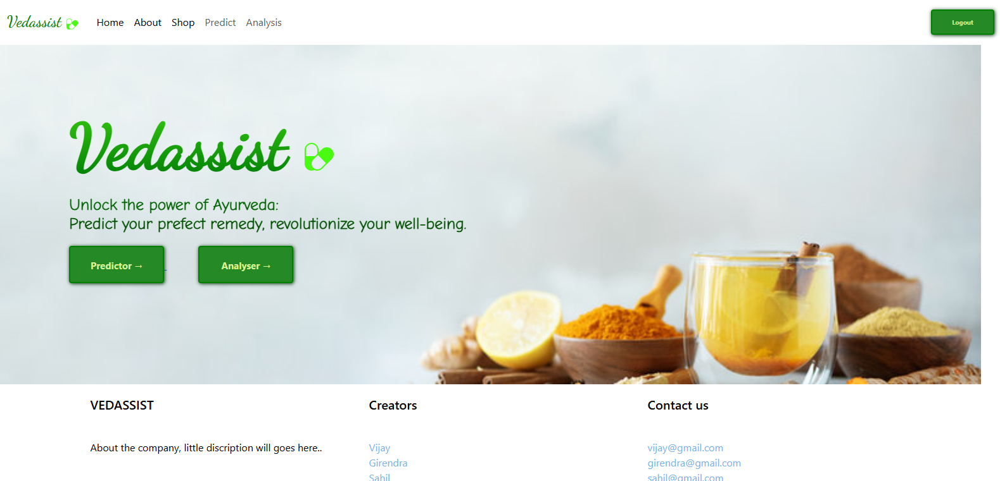

# [VEDASSIST]
### by [Girendra Singh](https://github.com/Giru-03)
### with [Vijay Varadarajan](https://github.com/vijay-varadarajan), [Sahil Murhekar](https://github.com/sahilmurhekar),  and [Ayush Mishra](https://github.com/Ayush-07-Mishra)
### from TamilNadu, India

<!-- #### Website: [VedAssist-site](https://vedassist.pythonanywhere.com/)
#### Video demo: [VedAssist-video_demo](https://www.youtube.com/watch?v=3GQp6SWrqrI) -->
#### Github repo link: [VedAssist-source_code](https://github.com/Giru-03/Vedassist)

## About this project
This is a web application made to promote the use of Ayurvedic and Allopathic medicines. The main aim of this project is to provide a platform for users to analyze the effects of different drugs and predict possible outcomes based on user inputs.

The website allows users to:
- Analyze the effects of combining Ayurvedic and Allopathic medicines.
- Predict possible outcomes based on symptoms and user details.
- Search for medicines and view detailed information about them.
- Buy medicines directly from the platform.

## Features

+ The cursor is modified to look like a **custom cursor** matching the website's theme.

+ Allows **quick analysis** without needing to login.

+ Provides a **detailed analysis** of drug effects based on user inputs.

+ Displays **names**, **descriptions**, **prices**, and **images** of medicines.

+ Lets users **buy medicines** directly from the platform.

+ Uses **Django** for backend processing and **SQLite** for database management.

## Installation requirements

<b> Framework used: </b> Django

The following dependencies must be installed using pip to run this web application.
<details>

<summary><b>Python dependencies</b></summary>

 - Django
 - Pickle

</details>

## Working / Usage instructions

1. Upon opening, the homepage of this website has buttons to take you to '**login**', '**register**', '**analyze**', '**predict**', and '**shop**' pages.



2. The **Analyze Drug Effect** section requires you to fill a form with the details of the herbs and allopathic drugs you are using, along with your age, gender, weight, doses, and duration.

3. After submitting the form, you can see the **analysis of the drug effects** based on your inputs.


4. The **Predict Symptoms** section requires you to fill a form with your symptoms and personal details.

5. After submitting the form, you can see the **predicted outcomes** based on your symptoms.


6. The **Shop** section allows you to search for medicines and view detailed information about them, including their prices and descriptions.


7. You can **buy medicines** directly from the platform by clicking on the **Buy** button on the medicine details page.


## Implementation details

### _**models.py**_

This file includes the models for the database. It defines the structure of the tables used in the application, such as `AyurvedicPrediction` and `Medicine`.

```python
class AyurvedicPrediction(models.Model):
    cold = models.IntegerField()
    eyepain = models.IntegerField()
    fever = models.IntegerField()
    headache = models.IntegerField()
    stomachache = models.IntegerField()
    dizziness = models.IntegerField()
    vomiting = models.IntegerField()
    chestpain = models.IntegerField()
    jointpain = models.IntegerField()
    loosemotion = models.IntegerField()
    throatinfection = models.IntegerField()
    age = models.IntegerField()
    gender = models.IntegerField()
    weight = models.IntegerField()
    medicine1 = models.CharField(max_length=100)
    medicine2 = models.CharField(max_length=100)
    medicine3 = models.CharField(max_length=100)
```

### _**static**_

This folder contains all the static files necessary for this web application. This includes the following **css files**: 

 - **test.css**: stylesheet for the analysis and prediction pages
 - **shop.css**: stylesheet for the shop page
 - **result.css**: stylesheet for the result page

This also includes the **background images** as well as the images for the **logo** and the **modified cursor**. 

### _**templates**_
This folder contains the html templates for all the different routes in this web application. Most of the css for these pages are linked from the files in static while some are borrowed from [bootstrap](https://getbootstrap.com) and [font-awesome](https://cdnjs.cloudflare.com/ajax/libs/font-awesome/4.7.0/css/font-awesome.min.css)

### _**db.sqlite3**_
This is the database that is used to store all the user and medicine information entered into this web application. This database contains the following tables: 

 * ### AyurvedicPrediction
    This stores the **information about the user's symptoms and personal details** along with the medicines they are using.

 * ### Medicine
    This table contains the **information of the medicines** available on the platform, including their names, prices, descriptions, and images.

### _**requirements.txt**_
This file contains the names of the required python dependencies that need to be installed before launching this web application.

## References

 - [Django](https://www.djangoproject.com/)
 - [Pickle](https://pypi.org/project/Pickle/)
 - [Bootstrap](https://www.getbootstrap.com)
